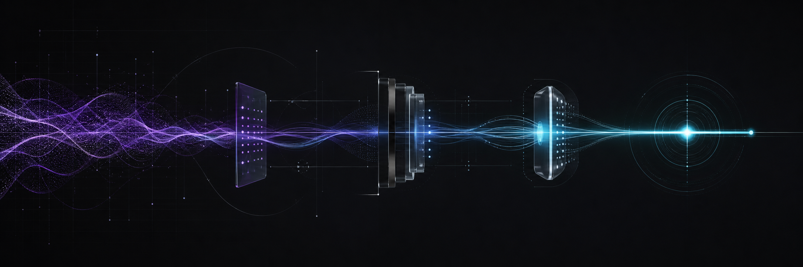

<div align="center">



# Gauthier Girault

### I build AI systems that act while the conversation is still happening.

Founder & solo engineer at **[Shot](https://github.com/zoxeavv/shot)** · Paris → San Francisco

[](https://x.com/gauthiergirlt)
[](mailto:thier0811@gmail.com)
[](https://github.com/zoxeavv/shot)

</div>

## Now: Shot

> A real-time coaching layer for B2B sales calls. The rep gets the next best move on screen; the prospect never sees the software.

- **Live context** — CRM, email, past calls, and the VP Sales playbook become useful during the conversation, not after it.
- **Invisible overlay** — protected from screen sharing across Zoom, Google Meet, Microsoft Teams, Loom, and OBS.
- **Latency as product** — Recall.ai → Gladia ASR → Anthropic streaming, engineered toward a sub-2s p95 response.
- **A learning loop** — manager corrections become governed rules that improve the next call for every rep.

Shot is the system I want to build for the next decade. The source is private; the [public project brief](https://github.com/zoxeavv/shot) documents the product and architecture.

## Proof, not pitch

| Signal | What shipped |
|---|---|
| **150K–190K / month** | Verified B2B emails from an autonomous enrichment engine running on **~€48/month** of infrastructure — [email-pipeline](https://github.com/zoxeavv/email-pipeline) |
| **83K LOC** | A full competitive-intelligence SaaS with adaptive scraping and 11 asynchronous workers — [Closer Claw](https://github.com/zoxeavv/Closer-Claw) |
| **896 tests** | A video-prospecting product with generation queues, billing, analytics, and org-scoped access — [Kiwi](https://github.com/zoxeavv/kiwi) |

## Selected systems

| Project | System | Status |
|---|---|---|
| **[Shot](https://github.com/zoxeavv/shot)** | Real-time AI coaching for B2B sales teams | **Building now** · source private |
| **[email-pipeline](https://github.com/zoxeavv/email-pipeline)** | Autonomous, cache-aware B2B email enrichment | Live |
| **[Closer Claw](https://github.com/zoxeavv/Closer-Claw)** | Competitive intelligence with selectors that survive DOM changes | Archived after the pivot |
| **[Kiwi](https://github.com/zoxeavv/kiwi)** | Personalized video prospecting at scale | Paused |

## How I build

```text
signal → context → decision → action → measured feedback → better rule
```

I work end-to-end: product, distributed systems, AI pipelines, desktop software, data, and deployment. My bias is toward short feedback loops, explicit failure modes, and evidence before claims.

<div align="center">


---

**Working on real-time AI, sales systems, or an SF incubator?**<br>
[Talk to me on X](https://x.com/gauthiergirlt) · [Send me an email](mailto:thier0811@gmail.com)

</div>
